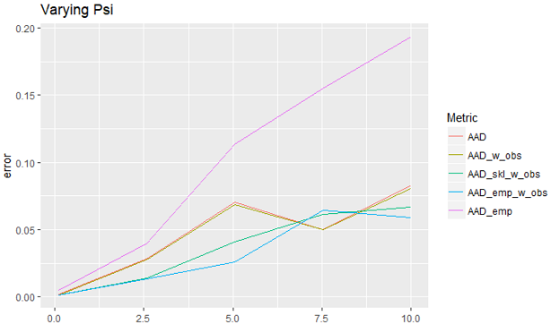
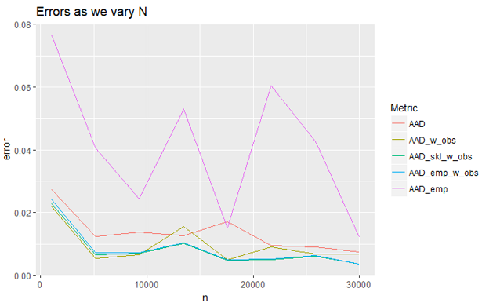

<a id="top"></a>

> [What does emfactor do](#what)

> [Installation](#install)

> [Demo with Artificial Data](#Demotoy)

> [Demo with Kaggle Data](#Demoreal)

> [Appendix](#append)


<a id="what"></a>

## What does emfactor do?

This package provides one function emfactor() which accepts a numeric matrix with potentially missing data and returns the parameters of a rank K factor model, estimated via the Expectation Maximization algorithm. Its three primary arguments are:

1. x: a numeric matrix with potentially missing values
2. k: the number of columns in $\mathbf{W}$ (discussed below) or the dimensional of the latent space.
3. iters: the maximum number of iterations.

It returns:

1. A list containing the estimated parameters of the model ($\mathbf{W}$, $\boldsymbol{\Psi}$, and $\boldsymbol{\mu}$), $\mathbf{Z}$ and an estimation of the covariance matrix. These are discussed in detail below.

This demo explains the derivation (in case you'd like to know what's going on under the hood), shows a demo on artificial data benchmarked against sklearn (without missing data) and finally, shows an application to some Kaggle/equity return data.

### Fully Observed Data

Let's assume we have fully observed real valued data in the form of a $N$-by-$D$ matrix $\mathbf{X}$, where each row represents an observation. A factor model with parameters $\boldsymbol{\theta}$ assumes:

$$
p(\mathbf{x}_{i}|\mathbf{z}_{i},\boldsymbol{\theta})=\mathcal{N}(\mathbf{x}_{i}|\mathbf{W}\mathbf{z}_{i}+\boldsymbol{\mu},\boldsymbol{\Psi})
$$
where $\mathbf{z}_i \in \mathbb{R}^K$ is a lower dimensional hidden variable, $\mathbf{x}_i$ is an observation, $\mathbf{W}$ is a $D$-by-$K$ matrix (called a 'factor loading matrix') and $\boldsymbol{\Psi}$ is a diagonal matrix. If we assume the prior distribution over $\mathbf{z}_i$ has mean 0 and an identity covariance matrix [^1] and integrate out the hidden variables, we get

$$
p(\mathbf{x}_{i}|\boldsymbol{\theta})=\mathcal{N}(\mathbf{x}_{i}|\boldsymbol{\mu},\mathbf{W}\mathbf{W}^T +\boldsymbol{\Psi})
$$
So as we can see, the covariance of $\mathbf{x}_i$ is explained in two additive parts: that which explains idiosyncratic variance ($\boldsymbol{\Psi}$) and that which is due to a $K$ dimensional source of correlation ($\mathbf{W}\mathbf{W}^T$). You can think of $\mathbf{W}\mathbf{W}^T$ as a partial rank K approximation to the empirical covariance of $\mathbf{x}_i$.

Unsurprisingly, the MLE for $\boldsymbol{\mu}$ is the empirical mean $\bar{\mathbf{x}}$. There is no closed form solution for the parameters $\mathbf{W}$ and $\boldsymbol{\Psi}$. Instead, we have an iterative solution that uses the Expectation Maximization (EM) algorithm. To apply this, we determine the auxiliary function: 
$$
Q(\boldsymbol{\theta},\boldsymbol{\theta}^{t-1})=\mathbb{E}_{\mathbf{X},\boldsymbol{\theta}^{t-1}}\Big[\sum_i \textrm{log }p(\mathbf{x}_i,\mathbf{z}_i|\boldsymbol{\theta})\Big]
$$
This function is the likelihood according to $\boldsymbol{\theta}$ of the data with hidden sufficient statistics filled in with their expectations according to $\boldsymbol{\theta}^{t-1}$. As we iterate through choices of $\boldsymbol{\theta}$, $Q$ should always increase. Let's get more specific. First, the log probability breaks up:

$$
\textrm{log }p(\mathbf{x}_{i},\mathbf{z}_{i}|\boldsymbol{\theta})=\textrm{log }p(\mathbf{z}_{i})+\textrm{log }p(\mathbf{x}_{i}|\mathbf{z}_{i},\boldsymbol{\theta})
$$
So we may consider the expectations of these components separately. First:

$$
\mathbb{E}\Big[\textrm{log }p(\mathbf{z}_{i})\Big]=-\frac{1}{2}\big(K\textrm{log}(2\pi)+\textrm{Tr}(\mathbb{E}\Big[\mathbf{z}_{i}\mathbf{z}_{i}^{T}\Big])\big)
$$

Next, we have:

$$
\begin{eqnarray*}
\mathbb{E}\Big[\textrm{log }p(\mathbf{x}_{i}|\mathbf{z}_{i},\boldsymbol{\theta})\Big] & = & -\frac{1}{2}\mathbb{E}\Big[D\textrm{log}(2\pi)+\textrm{log det}\boldsymbol{\Psi}+\\
 &  & \big((\mathbf{x}_{i}-\boldsymbol{\mu})-\mathbf{W}\mathbf{z}_{i}\big)^{T}\boldsymbol{\Psi}^{-1}\big((\mathbf{x}_{i}-\boldsymbol{\mu})-\mathbf{W}\mathbf{z}_{i}\big)\Big]\\
 & = & -\frac{1}{2}\Big(D\textrm{log}(2\pi)+\textrm{log det}\boldsymbol{\Psi}+\textrm{Tr}\Big(\big(\mathbf{x}_{i}\mathbf{x}_{i}^{T}-\\
 &  & 2\boldsymbol{\mu}\mathbf{x}_{i}^{T}+\boldsymbol{\mu}\boldsymbol{\mu}^{T}-2\mathbf{x}_{i}\mathbb{E}\Big[\mathbf{z}_{i}^{T}\Big]\mathbf{W}^{T}+\\
 &  & 2\boldsymbol{\mu\mathbb{E}\Big[}\mathbf{z}_{i}^{T}\Big]\mathbf{W}^{T}+\mathbf{W}\mathbb{E}\Big[\mathbf{z}_{i}\mathbf{z}_{i}^{T}\Big]\mathbf{W}^{T}\big)\boldsymbol{\Psi}^{-1}\Big)
\end{eqnarray*}
$$
So the auxiliary function is just these two terms summed over all $i$. [^2]

Performing the EM algorithm involves iterating between calculating the expectations of $\mathbf{z}_i$ (according to $\boldsymbol{\theta}^{t-1}$) and then maximizing the auxiliary function with respect to the parameters $\boldsymbol{\theta}$. Specifically:

1. Calculate the expectations, assuming the values of $\mathbf{W}$ and $\boldsymbol{\Psi}$.
$$
\begin{eqnarray*}
\mathbb{E}[\mathbf{z}_{i}] & = & \mathbf{G}\mathbf{W}^{T}\boldsymbol{\Psi}^{-1}(\mathbf{x}_{i}-\bar{\mathbf{x}})\\
\mathbb{E}[\mathbf{z}_{i}\mathbf{z}_{i}^{T}] & = & \mathbf{G}+\mathbb{E}[\mathbf{z}_{i}]\mathbb{E}[\mathbf{z}_{i}]^{T}\\
\mathbf{G} & = & (\mathbf{I}+\mathbf{W}^{T}\boldsymbol{\Psi}^{-1}\mathbf{W})^{-1}\\
\end{eqnarray*}
$$
This follows from an application of Bayes Theorem for Linear Gaussian Systems (see ref needed)

2. Maximize parameters.
$$
\begin{eqnarray*}
\mathbf{W}_{\textrm{next}} & = & \Big[\sum_{i}(\mathbf{x}_{i}-\bar{\mathbf{x}})\mathbb{E}[\mathbf{z}_{i}]^{T}\Big]\Big[\sum_{i}\mathbb{E}[\mathbf{z}_{i}\mathbf{z}_{i}^{T}]\Big]^{-1}\\
\boldsymbol{\Psi}_{\textrm{next}} & = & \textrm{diag}\Bigg[\mathbf{S}-\mathbf{W}_{\textrm{next}}\frac{1}{N}\Big[\sum_{i}\mathbb{E}[\mathbf{z}_{i}](\mathbf{x}_{i}-\bar{\mathbf{x}})^{T}\Big]\Bigg]
\end{eqnarray*}
$$
Where is $\mathbf{S}$ is just the empirical covariance matrix of $\mathbf{X}$. This maximization step is just linear regression. At this stage, the $\mathbf{z}_i$'s are effectively observed and we know they are linearly related to the $\mathbf{x}_i$'s. Seeing it from that angle, the above equations are just the know MLE equations for coefficients and noise variance of a linear regression model.

### With Missing Data

In this case, we'll have to reconsider the auxiliary function. This time, we keep in mind that the expectation formed isn't just in regards to $\mathbf{z}_i$, but also the potential missing values in any $\mathbf{x}_i$. With that in mind, the only chunk we need to reexamine is $\mathbb{E}\Big[\textrm{log }p(\mathbf{x}_{i}|\mathbf{z}_{i},\boldsymbol{\theta})\Big]$:

$$
\begin{eqnarray*}
\mathbb{E}\Big[\textrm{log }p(\mathbf{x}_{i}|\mathbf{z}_{i},\boldsymbol{\theta})\Big] & = & -\frac{1}{2}\mathbb{E}\Big[D\textrm{log}(2\pi)+\textrm{log det}\boldsymbol{\Psi}+\\
 &  & \big((\mathbf{x}_{i}-\boldsymbol{\mu})-\mathbf{W}\mathbf{z}_{i}\big)^{T}\boldsymbol{\Psi}^{-1}\big((\mathbf{x}_{i}-\boldsymbol{\mu})-\mathbf{W}\mathbf{z}_{i}\big)\Big]\\
  & = & -\frac{1}{2}\Big(D\textrm{log}(2\pi)+\textrm{log det}\boldsymbol{\Psi}+\textrm{Tr}\Big(\big(\mathbb{E}\Big[\mathbf{x}_{i}\mathbf{x}_{i}^{T}\Big]-\\
  &  & 2\boldsymbol{\mu}\mathbb{E}\Big[\mathbf{x}_{i}^{T}\Big]+\boldsymbol{\mu}\boldsymbol{\mu}^{T}-2\mathbb{E}\Big[\mathbf{x}_{i}\mathbf{z}_{i}^{T}\Big]\mathbf{W}^{T}+2\boldsymbol{\mu\mathbb{E}\Big[}\mathbf{z}_{i}^{T}\Big]\mathbf{W}^{T}+\\
  &  & \mathbf{W}\mathbb{E}\Big[\mathbf{z}_{i}\mathbf{z}_{i}^{T}\Big]\mathbf{W}^{T}\big)\boldsymbol{\Psi}^{-1}\Big)\\
\end{eqnarray*}
$$
This new auxiliary function implies an adjustment to our E and M step. It'll be helpful to split up $\mathbf{x}_i$ into an observed part and a hidden part. Call them $\mathbf{x}_{iv}$ and $\mathbf{x}_{ih}$ respectively. With that:

1. Calculate the expectations, assuming the values of $\mathbf{W}$ and $\boldsymbol{\Psi}$.

$$
\begin{eqnarray*}
\mathbb{E}[\mathbf{z}_{i}] & = & \mathbf{G}\mathbf{W}^{T}\boldsymbol{\Psi}^{-1}(\mathbb{E}\Big[\mathbf{x}_{i}\Big]-\boldsymbol{\mu})\\
\mathbb{E}[\mathbf{z}_{i}\mathbf{z}_{i}^{T}] & = & \mathbf{G}+\mathbb{E}[\mathbf{z}_{i}]\mathbb{E}[\mathbf{z}_{i}]^{T}\\
\mathbf{G} & = & (\mathbf{I}+\mathbf{W}^{T}\boldsymbol{\Psi}^{-1}\mathbf{W})^{-1}\\
\mathbb{E}\Big[\mathbf{x}_{i}\Big] & = & \left[\begin{array}{c}
\mathbb{E}\Big[\mathbf{x}_{ih}\Big]\\
\mathbf{x}_{iv}
\end{array}\right]\\
\mathbb{E}\Big[\mathbf{x}_{ih}\Big] & = & \mathbf{W}_{h}\mathbb{E}\Big[\mathbf{z}_{i}\Big]+\boldsymbol{\mu}_{h}\\
\mathbb{E}\Big[\mathbf{x}_{i}\mathbf{x}_{i}^{T}\Big] & = & \left[\begin{array}{cc}
\mathbb{E}\Big[\mathbf{x}_{ih}\mathbf{x}_{ih}^{T}\Big] & \mathbb{E}\Big[\mathbf{x}_{ih}\Big]\mathbf{x}_{iv}^{T}\\
\mathbf{x}_{iv}\mathbb{E}\Big[\mathbf{x}_{ih}^{T}\Big] & \mathbf{x}_{iv}\mathbf{x}_{iv}^{T}
\end{array}\right]\\
\mathbb{E}\Big[\mathbf{x}_{ih}\mathbf{x}_{ih}^{T}\Big] & = & \textrm{Cov}(\mathbf{x}_{ih}|\mathbf{x}_{iv})+\mathbb{E}\Big[\mathbf{x}_{ih}\Big]\mathbb{E}\Big[\mathbf{x}_{ih}^{T}\Big]\\
\mathbb{E}\Big[\mathbf{x}_{i}\mathbf{z}_{i}^{T}\Big] & = & \left[\begin{array}{c}
\mathbf{W}_{h}\mathbb{E}\Big[\mathbf{z}_{i}\mathbf{z}_{i}{}^{T}\Big]+\boldsymbol{\mu}_{h}\mathbb{E}\Big[\mathbf{z}_{i}{}^{T}\Big]\\
\mathbf{x}_{iv}\mathbb{E}\Big[\mathbf{z}_{i}{}^{T}\Big]
\end{array}\right]
\end{eqnarray*}
$$

where $\mathbf{W}_h$ are the rows of $\mathbf{W}$ selected out for the hidden variables. You may notice that the above is circular. This is fine, we just use the available values from the previous iteration. Further (and not made explicit here), we use the matrix inversion lemma in the inversion of the covariance matrix to speed up calculations.

2. Maximize parameters.
$$
\begin{eqnarray*}
\boldsymbol{\mu}_{\textrm{next}} & = & \frac{1}{N}\sum_{i}\mathbb{E}[\mathbf{x}_{i}]\\
\mathbf{W}_{\textrm{next}} & = & \Big[\sum_{i}\mathbb{E}[\mathbf{x}_{i}\mathbf{z}_{i}^{T}]-\boldsymbol{\mu}_{\textrm{next}}\mathbb{E}[\mathbf{z}_{i}^{T}]\Big]\Big[\sum_{i}\mathbb{E}[\mathbf{z}_{i}\mathbf{z}_{i}^{T}]\Big]^{-1}\\
\mathbf{S}_{\textrm{next}} & = & \frac{1}{N}\Big[\sum_{i}\mathbb{E}\Big[\mathbf{x}_{i}\mathbf{x}_{i}^{T}\Big]-\boldsymbol{\mu}_{\textrm{next}}\boldsymbol{\mu}_{\textrm{next}}^{T}\Big]\\
\boldsymbol{\Psi}_{\textrm{next}} & = & \textrm{diag}\Bigg[\mathbf{S}-\mathbf{W}_{\textrm{next}}\frac{1}{N}\Big[\sum_{i}\mathbb{E}[\mathbf{z}_{i}\mathbf{x}_{i}^{T}]-\mathbb{E}[\mathbf{z}_{i}]\boldsymbol{\mu}_{\textrm{next}}^{T}\Big]\Bigg]
\end{eqnarray*}
$$
In effect, the only difference is that we insert a step to determine the expectations of the missing values, and then carry on the calculating as though there is no missing data. Since $X$ will change over time, we will need to recalculate $\boldsymbol{\mu}$ and $\mathbf{S}$ as well.

[^1]: This is a reasonable assumption. If we were to change the parameters of the prior distribution to something else, we could make a change to the other parameters such that we could explain the data to the same extend had we not made that change.

[^2]: There is a good amount of redundancy from one $i$ term to the next, so in the code, we pull as much as we can out and multiply by $N$.

<a id="install"></a>

## Installation

First, you need to install the devtools package. This can be done from CRAN with the following:

```{r eval=FALSE}
install.packages("devtools")
```
After loading the package, install with:

```{r eval=FALSE}
install_github("Duane321/emfactor")
```

Then, you'll be free to load the package using devtools. The below path is specific to my computer, so you'll have to use the path where emfactor was saved on your computer.

```{r}
devtools::load_all('C:/Users/Duane/Documents/Github/R/emfactor')
```

<a id="Demotoy"></a>

##How do we know it's working?

The remaining question is, how do we know it's working properly? We can provide some affirmative evidence with simulated data and a few benchmark algorithms. Specifically, we can simulate data according to different sets of 'true' parameters and measure the algorithms' ability to approximate the true parameters from the data.

Because one of the benchmark algorithms is sklearn's factor analysis model (with no missing data), this section hasn't been set up for reproducibility. Rather, I merely offer the graphics from my testing and hopefully, they will convince you.

We evaluate the performance according to several metrics:

1. AAD: the average absolute difference (AAD) between the true covariance and the estimated covariance using emfactor
2. AAD_w_obs: AAD between the true covariance and the estimated covariance without missing values
3. AAD_skl_w_obs: AAD between the true covariance and the sklearn-estimated covariance without missing values
4. AAD_emp_w_obs: AAD between the true covariance and the empirical covariance without missing values
5. AAD_emp: AAD between the true covariance and the empirical covariance using only rows with no missing values

Unless we are varying a true parameter value, we use a true latent dimension of 2, 10 observed dimensions, an average latent dimension norm of 1, an average psi value of 0.5, missing percent of 35% and 20,000 data points. 

### Varying the size of $\boldsymbol{\Psi}$

If we plot the results for different values of the average $\Psi$ value, we observe this graphic:

```{r echo=FALSE}

```

So we discover that as we increase the average magnitude of $\Psi$, the error on all approaches tends to increase. This makes sense since this magnitude is an indication of the relative significance between the latent space and the intrinsic noise of each feature dimension. The important thing to realize is that AAD (the performance of our procedure with missing data) beats the plain empirical approach (where we drop rows with missing data) and it nearly tracks sklearn's factor model (which has no missing data!).


### Sizing up N

Now, we explore the behavior as we increase N.

```{r echo=FALSE}

```

As we can see, this converges and emfactor does nearly as well as sklearn with data filled in.

<a id="Demoreal"></a>

## Demo with Kaggle Data - How do we know it's useful?

Now that we've demonstrate this algorithm is doing its theoritical job, let's demonstrate that it's useful. Within this package is some (restructured) data from Kaggle's 2016 Two Sigma stock prediction competition. Specifically, it's the first 500 stocks, where the rows indicate daily observations. What we'll do is fit the model to the first half of the data and extract the two (chosen arbitrarily) vectors of $\mathbf{W}$. For the second half, we'll see if we can predict the returns of half of the stocks given the returns of the other half. Specifically, we'll use those observations to infer a $\mathbf{z}_i$ for each day and then use those to predict the unobserved stocks. As a contemporaneous prediction, this isn't necessarily useful for predicting the future, but its indicative of a meaningful and persistent latent structure.

First, we read in the data and determine our split for in-sample calibration and out of sample testing.

```{r}
kag <- as.matrix(read.csv('./kaggle_data.csv'))
split_t <- round(nrow(kag) * 0.5)
out_idx <- seq(split_t + 1, nrow(kag))
stocks_observed <- sample(colnames(kag), round(ncol(kag) * 0.5), replace=FALSE)
stocks_to_predict <- setdiff(colnames(kag), stocks_observed)
```

Next, we fit our model to the in-sample data. Here, we will use a latent dimension of 2.

```{r}
k <- 2
kag_emffit <- emfactor(kag[1:split_t, ], k, 10, verbose = TRUE)
```

Finally, we perform out of sample predictions and evaluate performance.

```{r}
g <- solve(diag(rep(1, k)) + t(kag_emffit$w) %*% diag(1/kag_emffit$psi) %*% kag_emffit$w)
to_predict <- kag[out_idx, stocks_to_predict]
predictions <- to_predict
predictions[] <- NA
#Form predictions
for(i in seq(length(out_idx))){
  obs_logi <- !is.na(kag[out_idx[i], stocks_observed])
  stocks_observed_at_i <- stocks_observed[obs_logi]
  zi <- g %*% t(kag_emffit$w[stocks_observed_at_i,]) %*% diag(1/kag_emffit$psi[stocks_observed_at_i]) %*% 
    (kag[out_idx[i],stocks_observed_at_i] - kag_emffit$mu[stocks_observed_at_i])
  predictions[i,] <- kag_emffit$w[stocks_to_predict,] %*% zi + kag_emffit$mu[stocks_to_predict]
}
#Evaluate predictions
obs_logi <- !is.na(to_predict)
error <-   to_predict[obs_logi] - predictions[obs_logi]
diff <- to_predict[obs_logi] - mean(to_predict[obs_logi])
R2 <- 1-sum(error * error)/sum(diff * diff)
var_explained <- max(-1, sign(R2) * sqrt(abs(R2)))
print(var_explained)
```

So we see that we can explain ~20% of the variance of unobserved stocks from the concurrent stock returns using only 2 latent dimensions. Given we are dealing with 500 stocks split 50-50 between unobserved and observed, this is a powerful result worth investigating. It is no surprise factor models are so prevalent in the financial industry.

[Back to Top](#top)

<a id="what"></a>

## References
 
1. Bishop, C. (2006). Pattern recognition and machine learning. Springer.
2. Murphy, K. (2012) Machine Learning: A Probabilistic Approach. MIT Press.
 
